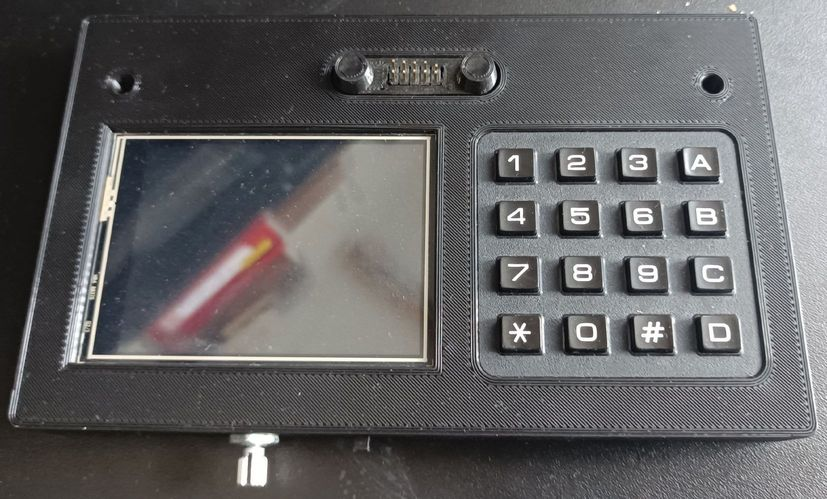

# Midibox

Midibox is a MIDI device which adds new possibilities to classic MIDI keyboard.
It contains mainly the MIDI serial interface, TFT display and 4x4 matrix keyboard.

# Software
Software is currently prepared for Roland FP4 digital piano.
Ir runs as Arduino program on rpi2040.
It allows to split keyboard to 8 layers and configure various programs,
each layer can be tranposed and some playing styles can be set for each layer.

# Simulator

As currently is only one known piece of hardware, for now the simulator is available.
